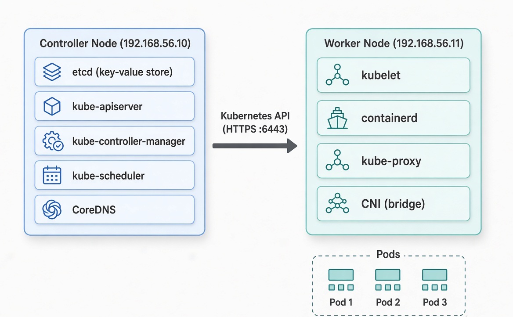

# Kubernetes The Hard Way — A Complete Conceptual Walkthrough

> Building a real Kubernetes cluster from scratch so you understand every moving part.

Inspired by Kelsey Hightower’s classic tutorial and implemented with Vagrant + scripts in the [k8s-hard-way](https://github.com/divyansh031/k8s-hard-way) repository.

---

## 1. Why “The Hard Way”?

Most people install Kubernetes with `kubeadm`, `kops`, or a managed service (EKS/GKE/AKS). Those tools hide the hard parts.

This project deliberately does the opposite.

We:

- Create virtual machines ourselves
- Generate every TLS certificate by hand
- Write every systemd unit
- Configure etcd, the API server, controller-manager, scheduler, kubelet, containerd, CNI and kube-proxy from scratch

The goal is not just a working cluster — it is **understanding**.

After finishing this project you will know:

- How components authenticate to each other
- Why certificates are required
- How kubeconfigs work
- Where cluster state actually lives
- How Linux services, networking and cgroups fit into Kubernetes

---

## 2. High-Level Architecture



```
                    +------------------+
                    |   controller-1   |
                    |  192.168.56.10   |
                    |                  |
                    |  etcd            |
                    |  kube-apiserver  |
                    |  controller-mgr  |
                    |  scheduler       |
                    |  CoreDNS         |
                    +--------+---------+
                             |
                             | Kubernetes API (HTTPS :6443)
                             |
                    +--------+---------+
                    |    worker-1      |
                    |  192.168.56.11   |
                    |                  |
                    |  kubelet         |
                    |  containerd      |
                    |  kube-proxy      |
                    |  CNI (bridge)    |
                    +------------------+
```

- **Controller** runs the control plane + etcd + CoreDNS
- **Worker** runs the actual pods
- Everything talks to the API server over TLS

---

## 3. Infrastructure — Vagrant & VirtualBox

### What is Vagrant?

Vagrant is **Infrastructure as Code**.  
You describe the machines you want in a `Vagrantfile`, then run:

```bash
vagrant up
```

Vagrant talks to VirtualBox (the actual hypervisor) and creates the VMs for you.

### Key decisions in this repo

| Setting              | Value              | Why |
|----------------------|--------------------|-----|
| Box                  | `ubuntu/jammy64`   | Clean Ubuntu 22.04 |
| Controller IP        | `192.168.56.10`    | Private host-only network |
| Worker IP            | `192.168.56.11`    | Same network |
| Controller RAM/CPU   | 2 GB / 2 cores     | Needs more resources |
| Worker RAM/CPU       | 1 GB / 1 core      | Enough for learning |

### Critical Linux preparation (`scripts/common.sh`)

Kubernetes has strict requirements:

1. **Disable swap**
   ```bash
   swapoff -a
   ```
   Kubernetes needs predictable memory behaviour. Swap makes that impossible.

2. **Enable IP forwarding**
   ```bash
   net.ipv4.ip_forward = 1
   ```
   Nodes must act like routers so pods can talk across machines.

3. **Populate `/etc/hosts`**
   ```
   192.168.56.10 controller-1
   192.168.56.11 worker-1
   ```
   Makes hostname-based communication and certificate validation easy.

### Files that drive infrastructure

- `Vagrantfile` — creates the VMs, assigns IPs, CPU, RAM and runs provisioning scripts
- `settings.yaml` — central configuration (IPs, versions, resources)
- `scripts/common.sh` — disables swap, configures hosts file, enables IP forwarding

---

## 4. Certificates — The Security Foundation

Kubernetes is a distributed system. Every component must prove its identity.

We create a **Certificate Authority (CA)** and then sign a certificate for every component.

### Mental model

```
                 CA (Root of Trust)
                      │
       ┌──────────────┼──────────────┐
       │              │              │
    Admin          Worker        API Server
                                   ▲
                                   │
                      Scheduler & Controller Manager
```

All communication is mutual TLS (mTLS).  
Both sides present a certificate signed by the same CA.

### Certificates we generate

| Certificate              | Used by                  | Role |
|--------------------------|--------------------------|------|
| `ca.pem` / `ca-key.pem`  | Everyone                 | Root of trust |
| `admin.pem`              | You / kubectl            | Cluster admin |
| `worker-1.pem`           | kubelet                  | Node identity |
| `kubernetes.pem`         | API server               | Server identity (must contain many SANs) |
| `controller-manager.pem` | Controller Manager       | Client identity |
| `scheduler.pem`          | Scheduler                | Client identity |
| `etcd.pem`               | etcd                     | Server + client identity |
| `service-account.pem`    | API server / Controller  | Signs & verifies ServiceAccount tokens |

### Why the API server certificate is special

It must contain **every possible name** clients might use:

```
10.32.0.1          (Kubernetes Service IP)
192.168.56.10      (controller IP)
127.0.0.1
controller-1
kubernetes.default
kubernetes.default.svc.cluster.local
```

If any name is missing → TLS handshake fails.

### How certificates are generated

All generation is automated by `scripts/certs.sh` using `cfssl`.

Example commands (conceptual):

```bash
# Create the CA
cfssl gencert -initca ca-csr.json | cfssljson -bare ca

# Create component certificates
cfssl gencert \
  -ca=ca.pem \
  -ca-key=ca-key.pem \
  -config=ca-config.json \
  -profile=kubernetes \
  admin-csr.json | cfssljson -bare admin
```

> **Security note**  
> Never commit `*-key.pem` files, especially `ca-key.pem`.  
> That key is the master key of the entire cluster.

---

## 5. Kubeconfigs — How Components Authenticate

A kubeconfig is a single file that answers three questions:

1. **Which cluster?** → API server address + CA certificate
2. **Who am I?** → Client certificate + private key
3. **Which context?** → Combination of the above

### Mental model

> **Kubeconfig** = Cluster Info + Authentication Info + Context

### Files created

| File                            | Used by                |
|---------------------------------|------------------------|
| `admin.kubeconfig`              | kubectl / you          |
| `controller-manager.kubeconfig` | Controller Manager     |
| `scheduler.kubeconfig`          | Scheduler              |
| `worker-1.kubeconfig`           | kubelet                |
| `kube-proxy.kubeconfig`         | kube-proxy             |

### Example: building a kubeconfig

```bash
# Set cluster
kubectl config set-cluster kubernetes-the-hard-way \
  --certificate-authority=ca.pem \
  --embed-certs=true \
  --server=https://192.168.56.10:6443 \
  --kubeconfig=worker-1.kubeconfig

# Set credentials
kubectl config set-credentials system:node:worker-1 \
  --client-certificate=worker-1.pem \
  --client-key=worker-1-key.pem \
  --embed-certs=true \
  --kubeconfig=worker-1.kubeconfig

# Set context
kubectl config set-context default \
  --cluster=kubernetes-the-hard-way \
  --user=system:node:worker-1 \
  --kubeconfig=worker-1.kubeconfig

# Use the context
kubectl config use-context default \
  --kubeconfig=worker-1.kubeconfig
```

Now the component just needs one file instead of five different flags.

All generation is automated by `scripts/kubeconfigs.sh`.

---

## 6. etcd — The Cluster’s Memory

etcd is a distributed key-value store.  
**Everything** Kubernetes knows lives inside etcd:

- Nodes
- Pods
- Deployments
- Secrets
- ConfigMaps
- ServiceAccounts
- …

### Mental model

```
kubectl / controllers / kubelets
            │
            ▼
     kube-apiserver
            │
            ▼
          etcd
```

Only the API server talks to etcd.  
No other component is allowed to touch it directly.

### Why a dedicated etcd certificate?

The original Kubernetes The Hard Way re-uses the API server certificate for etcd.  
This repository creates a separate `etcd.pem` so you clearly see that every component has its own identity.

### Key directories

| Path                                   | Purpose                        |
|----------------------------------------|--------------------------------|
| `/usr/local/bin/`                      | `etcd` and `etcdctl` binaries  |
| `/etc/etcd/`                           | TLS certificates               |
| `/var/lib/etcd/`                       | Actual database                |
| `/etc/systemd/system/etcd.service`     | systemd unit                   |

### Verification

```bash
sudo ETCDCTL_API=3 etcdctl \
  --cacert=/etc/etcd/ca.pem \
  --cert=/etc/etcd/etcd.pem \
  --key=/etc/etcd/etcd-key.pem \
  endpoint health
```

Expected output:

```
127.0.0.1:2379 is healthy
```

---

## 7. Control Plane Components

### 7.1 kube-apiserver — The Front Door

Every request goes through the API server.

It:

1. Authenticates the client (certificate)
2. Authorizes the request (RBAC / Node authorizer)
3. Validates the object
4. Reads/writes etcd
5. Notifies watchers (scheduler, controllers, kubelets)

#### Communication flow

```
kubectl / external client
        │
        │ HTTPS :6443 (TLS — server presents kubernetes.pem)
        ▼
  kube-apiserver
        │
        ├──► etcd :2379 (mTLS)
        │      stores/reads all cluster state
        │
        ├──► kubelet :10250 (HTTPS)
        │      for kubectl logs, exec, port-forward
        │
        ├──► notifies kube-scheduler
        │
        └──► notifies kube-controller-manager
```

Key certificates it needs:

- Its own TLS identity (`kubernetes.pem`)
- Client certs to talk to etcd
- CA cert to verify incoming clients
- ServiceAccount keys to sign & verify pod tokens

Script: `scripts/api-server.sh`

---

### 7.2 kube-controller-manager — The Brain

Runs ~30 controllers in one binary.  
Each controller is a continuous loop:

```
desired state  ≠  actual state  →  take action
```

#### Important controllers

| Controller                | Watches            | Action |
|---------------------------|--------------------|--------|
| Deployment controller     | Deployments        | Creates/deletes ReplicaSets |
| ReplicaSet controller     | ReplicaSets        | Creates/deletes Pods |
| Node controller           | Node heartbeats    | Marks nodes NotReady, evicts pods |
| Endpoint controller       | Services + Pods    | Keeps Endpoints in sync |
| ServiceAccount controller | Namespaces         | Creates default ServiceAccount |
| Namespace controller      | Namespaces         | Cleans up resources on deletion |
| Job controller            | Jobs               | Creates pods and tracks completions |

It never talks to etcd directly — everything goes through the API server.

#### Reconciliation loop (how every controller works)

```
loop forever:
  desired = what the user declared (e.g. 3 replicas)
  actual  = what's currently running (e.g. 2 pods exist)

  if actual != desired:
    take action (e.g. create 1 more pod)
```

This is why Kubernetes is self-healing.

Script: `scripts/controller-manager.sh`

---

### 7.3 kube-scheduler — The Air Traffic Controller

Only job: decide **which node** a pod should run on.

1. Watches for pods with empty `spec.nodeName`
2. Filters nodes that cannot run the pod
3. Scores the remaining nodes
4. Writes the chosen node name back to the pod
5. kubelet on that node sees the assignment and starts the pod

#### Scheduling process

**Phase 1 — Filtering** (which nodes can run this pod?)

- Enough CPU / memory?
- Satisfies nodeSelector / nodeAffinity?
- Tolerates the node’s taints?
- Required ports available?
- Required volumes accessible?

**Phase 2 — Scoring** (which remaining node is best?)

- Prefer nodes with most free resources
- Prefer nodes that already have the image cached
- Prefer different zones (for HA)

The scheduler never talks to kubelets — only to the API server.

Script: `scripts/scheduler.sh`

---

### 7.4 RBAC — Who Can Do What

We enable `--authorization-mode=Node,RBAC`.

- **Node** authorizer → special rules for kubelets
- **RBAC** → everything else

#### Important custom rule

The API server needs permission to talk to kubelets (for `kubectl logs`, `exec`, `port-forward`).

We create:

```yaml
# ClusterRole
apiVersion: rbac.authorization.k8s.io/v1
kind: ClusterRole
metadata:
  name: system:kube-apiserver-to-kubelet
rules:
  - apiGroups: [""]
    resources:
      - nodes/proxy
      - nodes/stats
      - nodes/log
      - nodes/spec
      - nodes/metrics
    verbs: ["*"]
```

```yaml
# ClusterRoleBinding
apiVersion: rbac.authorization.k8s.io/v1
kind: ClusterRoleBinding
metadata:
  name: system:kube-apiserver
roleRef:
  kind: ClusterRole
  name: system:kube-apiserver-to-kubelet
subjects:
  - kind: User
    name: kubernetes          # matches CN in kubernetes.pem
    apiGroup: rbac.authorization.k8s.io
```

Script: `scripts/rbac.sh`

---

## 8. Worker Node Stack

### 8.1 containerd + runc

```
kubelet
   │  (CRI)
   ▼
containerd
   │  (OCI)
   ▼
runc + Linux kernel (namespaces, cgroups, …)
```

**containerd** is the high-level container runtime.  
**runc** is the low-level tool that actually creates containers using Linux kernel features.

#### Critical configuration

```toml
SystemdCgroup = true
```

This **must** match the kubelet setting `cgroupDriver: systemd`.  
Mismatch causes mysterious resource and OOM problems.

#### Required packages and kernel settings

- `socat`, `conntrack`, `ipset` — needed for networking and debugging
- Kernel modules: `overlay`, `br_netfilter`
- Sysctl: `net.bridge.bridge-nf-call-iptables=1`, `net.ipv4.ip_forward=1`

Script: `scripts/containerd.sh`

---

### 8.2 CNI — Pod Networking

Kubernetes has no built-in networking.  
It calls a CNI plugin whenever a pod is created or deleted.

In this repo we use the simple **bridge** plugin:

```json
{
  "cniVersion": "0.4.0",
  "name": "bridge",
  "type": "bridge",
  "bridge": "cnio0",
  "isGateway": true,
  "ipMasq": true,
  "ipam": {
    "type": "host-local",
    "ranges": [[{"subnet": "10.200.1.0/24"}]],
    "routes": [{"dst": "0.0.0.0/0"}]
  }
}
```

#### What happens when a pod starts

1. Create network namespace
2. Create veth pair
3. Attach one end to the pod, other end to `cnio0` bridge
4. Assign an IP from the node’s pod CIDR (`10.200.1.0/24` for worker-1)
5. Configure default route via the bridge

#### Communication matrix

| Communication Type              | Works Out-of-Box? | Notes |
|---------------------------------|-------------------|-------|
| Pod ↔ Pod (same node)           | Yes               | Bridge + veth |
| Pod → Service (ClusterIP)       | Mostly Yes        | kube-proxy iptables rules |
| Pod → External                  | Yes               | ipMasq + IP forwarding |
| Pod ↔ Pod (different nodes)     | No (not automatic)| Missing inter-node routes |

**Limitation**: This learning setup does **not** configure cross-node pod routing.  
Production CNIs (Calico, Cilium, Flannel) do this automatically.

Script: `scripts/cni.sh`

---

### 8.3 kubelet — The Node Agent

kubelet is the only component that talks to both the Linux OS and the container runtime.

#### Responsibilities

- Register the node with the API server
- Watch the API server for pods assigned to this node
- Call CNI to set up networking
- Call containerd to start/stop containers
- Run health probes (liveness, readiness, startup)
- Report node and pod status back to the API server
- Mount volumes, inject Secrets/ConfigMaps, collect logs
- Garbage-collect unused images and containers

#### Mental model

```
API Server (Cluster State)
          │
          │ Watch
          ▼
       kubelet
   (on every node)
          │
          ▼
   containerd + CNI
          │
          ▼
      Actual Pods
```

#### Important configuration (`kubelet-config.yaml`)

```yaml
authentication:
  webhook:
    enabled: true
  anonymous:
    enabled: false

authorization:
  mode: Webhook

clusterDomain: cluster.local
clusterDNS:
  - 10.32.0.10

podCIDR: 10.200.1.0/24
cgroupDriver: systemd
```

Key flags:

```bash
--container-runtime-endpoint=unix:///var/run/containerd/containerd.sock
--kubeconfig=/var/lib/kubelet/kubeconfig
--register-node=true
```

Script: `scripts/kubelet.sh`

---

### 8.4 kube-proxy — Making Services Work

kube-proxy watches Services and Endpoints and programs **iptables** rules on every node.

#### What it enables

| Feature          | How kube-proxy helps            |
|------------------|---------------------------------|
| ClusterIP        | iptables DNAT rules             |
| Load Balancing   | Probabilistic backend selection |
| NodePort         | Port forwarding on every node   |
| External Traffic | Source NAT (masquerading)       |

#### Mental model

```
Pod A
  │
  ▼
Service ClusterIP (10.32.0.x)
  │
  ▼
kube-proxy (iptables rules)
  │
  ▼
Load Balancing
  ┌──────┬──────┬──────┐
  ▼      ▼      ▼
Pod B  Pod C  Pod D
```

Without kube-proxy a Service object exists but traffic never reaches the pods.

Script: `scripts/kube-proxy.sh`

---

## 9. CoreDNS — Service Discovery

Pods need a stable way to find each other.  
IP addresses change; DNS names do not.

CoreDNS runs as a normal Deployment in the `kube-system` namespace and is exposed as a ClusterIP Service at `10.32.0.10`.

Every pod’s `/etc/resolv.conf` points to that address (configured by kubelet via `clusterDNS`).

### How DNS resolution works

1. Pod queries `nginx.default.svc.cluster.local`
2. Query goes to `10.32.0.10:53` (CoreDNS)
3. CoreDNS watches Services / Endpoints / Pods via the API
4. Returns the correct ClusterIP
5. For external names (google.com) it forwards to the host’s upstream DNS

### Corefile (simplified)

```
.:53 {
    errors
    health
    ready
    kubernetes cluster.local in-addr.arpa ip6.arpa {
      pods insecure
      fallthrough in-addr.arpa ip6.arpa
      ttl 30
    }
    forward . /etc/resolv.conf
    cache 30
    loop
    reload
    loadbalance
}
```

Script: `scripts/core-dns.sh`

---

## 10. Putting It All Together — A Pod’s Life

1. You run `kubectl apply -f nginx.yaml`
2. API server stores the Pod object in etcd
3. Scheduler notices the unscheduled pod → assigns it to `worker-1`
4. kubelet on worker-1 sees the assignment
5. kubelet calls CNI → pod gets network namespace + IP
6. kubelet calls containerd → container starts
7. kube-proxy has already programmed the Service rules
8. CoreDNS makes the Service discoverable by name
9. Controllers keep watching and healing anything that drifts

---

## 11. Repository Structure (Quick Reference)

```
.
├── certs/                  # CSR JSON files + generated certificates
├── control-plane/
│   ├── api-server/
│   ├── controller-manager/
│   ├── etcd/
│   ├── rbac/
│   └── scheduler/
├── kubeconfigs/            # Generated kubeconfig files
├── scripts/                # All automation scripts
├── vagrant/
├── worker/
│   ├── cni/
│   ├── containerd/
│   ├── core-dns/
│   ├── kubelet/
│   └── kube-proxy/
├── Vagrantfile
├── settings.yaml
└── README.md
```

---

## 12. Learning Outcomes

After completing this project you will understand:

- Why every component needs its own certificate
- How kubeconfigs bundle identity + trust + endpoint
- Why etcd is the single source of truth
- How the control plane components cooperate through the API server
- How Linux primitives (cgroups, namespaces, bridges, iptables, systemd) become Kubernetes
- Why swap must be off and IP forwarding must be on
- How a simple bridge CNI works and what is still missing for multi-node networking

---

## 13. Final Mental Model

```
Desired State (declared by you)
        │
        ▼
   kube-apiserver  ←→  etcd
        │
   ┌────┼────┐
   │    │    │
   ▼    ▼    ▼
Scheduler  Controllers  kubelets
                │
                ▼
         containerd + CNI + kube-proxy
                │
                ▼
           Running Pods
```

Everything is secure, authenticated, authorized, and self-healing — and you built every piece yourself.

That is **Kubernetes the Hard Way**.

---

## References

- Original tutorial: [Kubernetes The Hard Way](https://github.com/kelseyhightower/kubernetes-the-hard-way) by Kelsey Hightower
- This implementation: [divyansh031/k8s-hard-way](https://github.com/divyansh031/k8s-hard-way)


