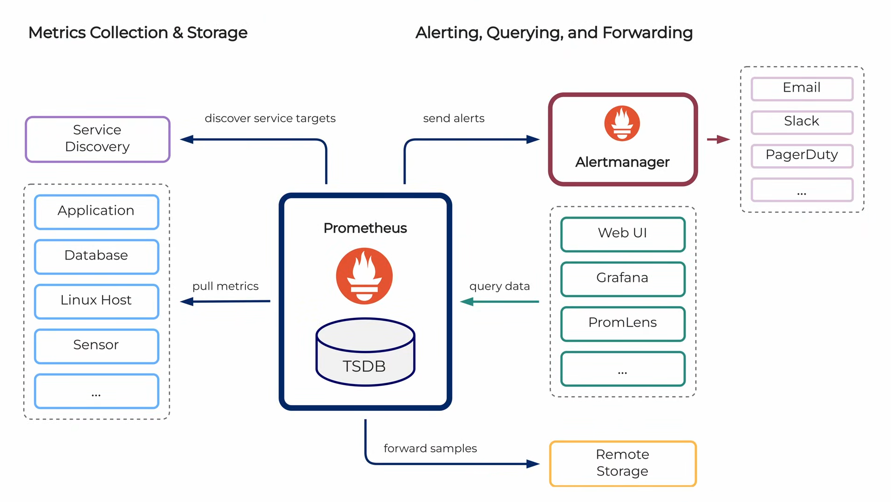
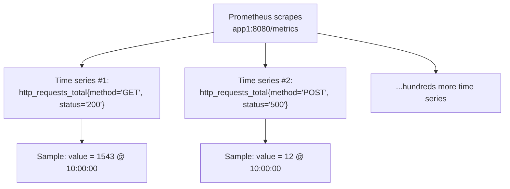
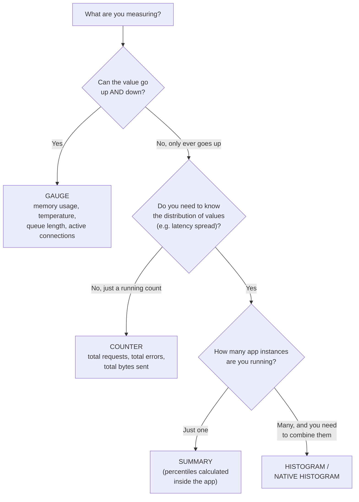
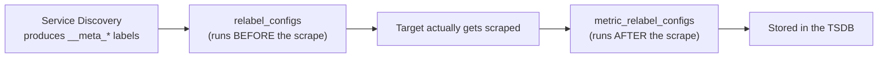

# Prometheus, In and Out: A Beginner's Complete Guide

If you've ever run a service and asked "wait, is this thing actually healthy right now?" — you've bumped into the exact problem Prometheus was built to solve. This post walks through Prometheus from the ground up: what it is, how it thinks about data, how to run it, how to query it, and the mistakes almost everyone makes on their first try. By the end, you should be able to look at any Prometheus setup and understand exactly what's happening under the hood.

Let's start at the very beginning.

---

## 1. What Is Prometheus, Really?

Prometheus is a **metrics-based monitoring system**. Its entire job is to help you answer one question, over and over, forever: *are my systems healthy and behaving correctly?*

To do that, it gives you a full toolchain rather than just one tool:

- **Libraries** that let your applications *expose* metrics about themselves
- A **server** that *collects* and *stores* those metrics over time
- **Ways to use the data** — alerting, dashboards, ad-hoc debugging, even automation

It's written in Go, and it's hosted by the CNCF (the same foundation that hosts Kubernetes) under open governance — meaning no single company owns it or can quietly change its direction.

Here's the important mental shift if you're coming from traditional monitoring tools: Prometheus doesn't wait for your application to *tell* it something is wrong. It goes and *asks*, on a schedule, forever. That one design decision — **pull instead of push** — shapes almost everything else about how the system works, so keep it in the back of your mind as we go.

### Architecture


---

## 2. The Building Blocks: Targets, Scrapes, Time Series, and Samples

Before touching any config files, you need four words to click into place, because every single feature in Prometheus is built on top of them.

**Target** — anything that exposes metrics on an HTTP endpoint (almost always `/metrics`). It could be your own application instrumented with a Prometheus client library, or a third-party system like a database or a Linux host, monitored via a helper process called an **exporter** that translates its stats into Prometheus's format.

**Scrape** — the actual act of Prometheus visiting a target's `/metrics` endpoint and pulling down whatever numbers are currently there.

**Time series** — a unique combination of a metric *name* plus a set of *labels*. Think of it as the *identity* of a stream of data, not the data itself.

**Sample** — one single value of a time series, at one specific moment in time.

That last distinction — time series vs. sample vs. scrape — trips people up constantly, so here's the analogy that makes it click:

| Concept | Stock Market Analogy |
|---|---|
| **Time series** | A particular stock, e.g. Tesla |
| **Sample** | Tesla's price at exactly 10:00 AM |
| **Scrape** | Checking the whole market once and recording current prices of many stocks at the same moment |

So when Prometheus scrapes `app1:8080/metrics` and that endpoint happens to expose 800 different time series, one scrape produces 800 samples — one fresh data point for each series, all stamped with the same timestamp.



A concrete example of a single time series with a sample attached:

```
http_requests_total{method="GET", status="200", instance="app1:8080"}  1543  @ 10:00:00
```

Everything before the value is the *identity* (name + labels). The `1543 @ 10:00:00` part is the *sample* — one value, one moment.

---

## 3. The Five Pillars That Make Prometheus Work

Julius Volz, one of Prometheus's co-creators, frames the whole system around five features. Once you understand these five, you basically understand Prometheus.

### Pillar A: The Dimensional Data Model

This is the foundation everything else sits on. A Prometheus time series is a **metric name** plus a set of **labels**.

- The **metric name** describes *what* you're measuring — `http_requests_total`, `temperature`, `memory_usage_bytes`.
- **Labels** are key-value pairs that add *dimensions* to that measurement, letting you slice the same metric a dozen different ways:

```
http_requests_total{method="POST", status="500", path="/api/login"}
```

Prometheus also automatically attaches labels that identify *which target* a series came from (these are called target labels), on top of whatever labels the target itself adds.

### Pillar B: The Metrics Transfer Format

Targets expose their current metric values over HTTP (usually on `/metrics`) using a deliberately simple, human-readable text format:

```
# HELP http_requests_total Total number of HTTP requests
# TYPE http_requests_total counter
http_requests_total{status="200"} 1027
http_requests_total{status="500"} 3
process_open_fds 15
```

A few things worth internalizing here:

- Each scrape only ever sends **current** values — there's no history baked into the response. History only exists because Prometheus itself stores each scrape over time.
- The scrape *frequency* is controlled by Prometheus, not by the app being monitored.
- The format is intentionally simple enough that you could hand-write it without any client library — which is exactly why exporters for almost anything exist.
- You can literally open a `/metrics` URL in your browser right now and read the raw numbers.

### Pillar C: PromQL — the Query Language

PromQL is purpose-built for doing math across time series. A few examples that build on each other:

```promql
# 1. Just select the raw series for 500 errors
http_requests_total{status="500"}

# 2. Turn the ever-increasing counter into a per-second rate
rate(http_requests_total{status="500"}[5m])

# 3. Aggregate across everything, but keep the "path" label
sum by (path) (rate(http_requests_total{status="500"}[5m]))

# 4. Calculate an error percentage per path, and only show the bad ones
(
  sum by (path) (rate(http_requests_total{status="500"}[5m]))
  /
  sum by (path) (rate(http_requests_total[5m]))
) * 100 > 5
```

Query 4 there is a genuinely useful, real alert condition: "show me every URL path whose error rate has crossed 5%." We'll come back to PromQL in much more depth later in this post.

### Pillar D: Integrated Alerting

You write alerting rules in PromQL. When the condition becomes true, Prometheus doesn't email anyone directly — it hands the alert off to a separate component called **Alertmanager**, whose whole job is grouping related alerts together, deduplicating them, routing them to the right team, silencing known issues, and finally sending notifications (Slack, PagerDuty, email, whatever you've configured).

### Pillar E: Service Discovery

In a static world you could just list every target by hand. But in a world of Kubernetes pods and auto-scaling groups, instances appear and disappear constantly. Service discovery lets Prometheus automatically find targets from systems like Kubernetes, Consul, DNS, or EC2, so your monitoring keeps up with your infrastructure without manual config edits.

---

## 4. Getting Prometheus Running (The Minimal Setup)

Enough theory — here's the smallest possible way to get a real Prometheus server up and scraping data. No Alertmanager, no Grafana, no real exporters yet. Just the server itself.

**Step 1 — Download** the pre-built binary for your OS from [prometheus.io](https://prometheus.io) → Downloads.

**Step 2 — Unpack it:**

```bash
tar xvfz prometheus-*.tar.gz
cd prometheus-*
```

**Step 3 — Write a minimal `prometheus.yml`:**

```yaml
global:
  scrape_interval: 5s          # how often to scrape (5s is a demo value, not production)

scrape_configs:
  - job_name: prometheus
    static_configs:
      - targets: ["localhost:9090"]     # Prometheus scrapes itself!

  - job_name: demo
    static_configs:
      - targets:
        - "demo.promlabs.com:10000"
        - "demo.promlabs.com:10001"
        - "demo.promlabs.com:10002"
```

**Step 4 — Run it:**

```bash
./prometheus
```

With no other flags, Prometheus reads `prometheus.yml` from the current directory, stores its time-series database in a local `./data` folder, and serves its web UI at `http://localhost:9090`.

A few config details worth calling out:

- **`scrape_interval`** controls how often Prometheus pulls data — and note that this lives on the Prometheus *side* of the equation, not the app's.
- **`job_name`** in your config becomes an actual **`job` label** attached to every time series scraped by that job. This single fact explains a lot of what you'll see later in PromQL queries.
- **`static_configs`** is the simplest possible way to list targets — hard-coded, no service discovery involved.
- Once it's running, the very first place to check whether things are working is the **Targets page** (`Status → Targets` in the UI). Green means `UP`.
- Prometheus **always monitors itself** — it exposes its own internal metrics on `/metrics`, which is a neat, if slightly recursive, sanity check.

The full data flow, end to end, looks like this:

1. An application (or an exporter sitting in front of a non-Prometheus system) keeps its current metric values in memory.
2. It exposes those values over HTTP, usually on `/metrics`, in the text format shown earlier.
3. Prometheus scrapes that endpoint on a schedule.
4. Prometheus stores the results in its local time-series database (TSDB).
5. You query that stored data using PromQL — via the web UI, Grafana, or any compatible tool.

One practical tip: a 5-second scrape interval is fine for demos and experiments, but production systems typically scrape every **15 to 60 seconds** — scraping too aggressively just wastes resources for information you rarely need at that resolution.

---

## 5. Choosing the Right Metric Type

Prometheus gives you four classic metric types, plus a newer, better version of one of them called Native Histograms. Picking the right one for the job matters — using the wrong type leads to broken math down the line (more on that in the mistakes section).



### Gauge — a number that goes up and down

A gauge represents the *current* value of something. Memory usage, current temperature, items in a queue, active connections, free disk space — anything that can go up one moment and down the next.

```go
memoryUsage.Set(512.5)     // set to an absolute value
queueLength.Inc()          // +1
queueLength.Dec()          // -1
queueLength.Add(10)        // +10
```

In PromQL, you generally just graph a gauge directly — no special function required.

### Counter — a number that only ever goes up

Total HTTP requests since the app started, total errors, total bytes sent — these only increase (they only reset to zero when the process itself restarts).

```go
httpRequests.Inc()   // +1
httpRequests.Add(5)  // +5
// You cannot decrease a counter or set it to an absolute value
```

The golden rule: **never graph the raw value of a counter.** A raw counter like `http_requests_total = 15420` only tells you the total since the process booted — it says nothing about *speed*. Always wrap it in one of three functions, which we'll dig into properly in the next section:

```promql
rate(http_requests_total[5m])
```

### Summary — percentiles calculated inside your app

A summary tracks the *distribution* of values (classically, request latencies) and calculates percentiles — p50, p90, p99 — right there inside the application, before the data ever reaches Prometheus.

Why do percentiles matter more than an average? Because averages lie. Imagine 99 requests take 0.1 seconds and one unlucky request takes 10 seconds — the average looks like a perfectly respectable 0.2 seconds, but real users are, in fact, sometimes waiting ten full seconds. Percentiles expose that:

- **p50** — half of all requests were faster than this
- **p90** — 90% of requests were faster than this
- **p99** — 99% of requests were faster than this

```go
requestDuration.Observe(0.45)   // this particular request took 0.45s
```

What Prometheus actually receives:

```
request_duration_seconds{quantile="0.5"}   0.23
request_duration_seconds{quantile="0.9"}   0.67
request_duration_seconds{quantile="0.99"}  1.8
request_duration_seconds_sum               1543.2
request_duration_seconds_count             4200
```

The catch, and it's a big one: **you cannot correctly combine summaries from multiple servers.** If Server A reports a p90 of 0.5s and Server B reports a p90 of 1.5s, averaging them to get 1.0s is meaningless — you don't know how many requests each server actually handled or what their underlying distributions looked like. There's no valid mathematical way to average pre-calculated percentiles from different sources.

### Histogram — percentiles you *can* combine across servers

A histogram also tracks distribution, but instead of calculating percentiles inside the app, it sorts observations into predefined **buckets**, and Prometheus calculates percentiles afterward, at query time. Crucially, Prometheus histogram buckets are **cumulative** — each bucket counts everything at or below its threshold.

```go
requestDuration.Observe(0.45)   // same call as Summary, different metric type underneath
```

What Prometheus receives:

```
request_duration_seconds_bucket{le="0.1"}   120
request_duration_seconds_bucket{le="0.5"}   890
request_duration_seconds_bucket{le="1"}     3100
request_duration_seconds_bucket{le="2"}     4050
request_duration_seconds_bucket{le="+Inf"}  4200
request_duration_seconds_sum                1543.2
request_duration_seconds_count              4200
```

Reading it: `le="0.5" = 890` means 890 requests took 0.5 seconds or less. `le="1" = 3100` means 3100 requests took 1 second or less. And so on, up to `+Inf`, which always equals the total count.

Here's the payoff — because you still have the raw bucket counts (not a pre-baked percentile), you *can* add histograms from multiple servers together and calculate an accurate combined percentile afterward:

| Bucket (le) | Server A | Server B | Combined |
|---|---|---|---|
| 0.1s | 200 | 150 | 350 |
| 0.5s | 700 | 400 | 1100 |
| 1.0s | 900 | 800 | 1700 |
| 2.0s | 980 | 950 | 1930 |
| +Inf | 1000 | 1000 | 2000 |

```promql
histogram_quantile(0.9, sum by (le) (rate(request_duration_seconds_bucket[5m])))
```

This works precisely *because* you still have the underlying distribution shape (how many requests fell into each range) rather than a single, already-collapsed number.

### Native Histograms — the modern fix for histogram's rough edges

Classic histograms have real downsides: you have to guess your bucket boundaries in advance, a bad guess means poor accuracy or wasted resources, and every bucket becomes its own time series — which can spiral into a cardinality problem on high-traffic metrics.

Native Histograms solve this by having Prometheus manage the bucket structure automatically and efficiently:

| Feature | Classic Histogram | Native Histogram |
|---|---|---|
| Bucket definition | You define manually | Handled automatically |
| Memory efficiency | Lower | Much better |
| Resolution | Limited by your bucket choices | Higher |
| Cardinality risk | Higher | Lower |
| Direction | Still fully supported | Preferred going forward |

### The quick decision table

| What you need | Use this |
|---|---|
| A current value that goes up and down | **Gauge** |
| Counting events (requests, errors, etc.) | **Counter** |
| Latency percentiles, single instance only | Summary |
| Latency percentiles, many instances combined | **Histogram** |
| The best modern approach to distributions | **Native Histogram** |

---

## 6. PromQL: How Prometheus Actually Selects Your Data

Before PromQL can calculate anything, it first has to figure out *which* data you're even talking about. This selection step has more nuance than it looks like at first glance, and understanding it will save you from a lot of confusing, gappy graphs later.

### Instant vector selectors

The simplest possible query just names a metric:

```promql
demo_memory_usage_bytes
```

This returns the *latest* sample from every time series carrying that metric name, all aligned to the same evaluation timestamp — one value per series.

You narrow this down with label matchers inside curly braces:

| Matcher | Meaning | Example |
|---|---|---|
| `=` | Exactly equal | `{type="buffers"}` |
| `!=` | Not equal | `{type!="free"}` |
| `=~` | Regex match | `{type=~"buffers\|cached"}` |
| `!~` | Regex does *not* match | `{type!~"buffers\|cached"}` |

```promql
demo_memory_usage_bytes{type=~"buffers|cached", instance="demo-service-0:10000"}
```

That query selects only memory of type `buffers` or `cached`, and only from one specific instance.

### The 5-minute lookback delta

Here's a subtlety that catches a lot of people off guard: when you ask for the "latest" value of a series, Prometheus doesn't require a sample to exist at *exactly* the query's timestamp. Instead, it looks **backwards up to 5 minutes** and uses the most recent sample it can find within that window.

```
Scrape points:      x----x----x----x----x----x
                     10:00  10:15 10:30 10:45 11:00 11:15
                                                        ^
Query evaluated at:                                  11:16
Lookback window:      <---------- up to 5 min back ---->
Result: uses the 11:15 sample (most recent within 5 min)
```

Why 5 minutes specifically? Any shorter, and you'd need unrealistically frequent scraping just to avoid gaps. Any longer, and Prometheus would keep showing stale data from processes that already died. If *no* sample exists within that 5-minute window, the series simply isn't returned — which is what causes those little gaps you sometimes see in graphs.

### Staleness markers

Prometheus is actually smarter than the blunt 5-minute rule alone. When a time series disappears — the process dies, the scrape fails, the metric stops being exported — Prometheus writes a special **staleness marker**. From that point on, the series is dropped from query results *immediately*, without waiting out the full 5-minute window.

### Range vector selectors

Instead of a single latest value, a range vector returns *every* raw sample within a time window:

```promql
demo_memory_usage_bytes[1m]
```

You can't graph a range vector directly — it's a pile of raw points, not a single line — so you almost always feed it into a function, most commonly `rate()`:

```promql
rate(http_requests_total[5m])
```

### Shifting time with `offset`

Sometimes you want to compare *now* against some point in the past — today versus yesterday, this week versus last week:

```promql
http_requests_total offset 1h
```

This grabs the data from one hour ago and presents it as if it were current. It works on range vectors too:

```promql
rate(http_requests_total[5m] offset 1d)
```

### Pinning an exact moment with `@`

Where `offset` is relative, the `@` modifier pins your query to an absolute point in time:

```promql
http_requests_total @ 1684761600      # a specific Unix timestamp
http_requests_total @ start()         # the start of the current graph range
http_requests_total @ end()           # the end of the current graph range
http_requests_total @ end() offset 1h # jump to the end of the range, then step back 1h
```

### Selection cheat sheet

| Concept | What it does | Example |
|---|---|---|
| Instant vector | Latest value of matching series | `metric_name` |
| Label matchers | Filter series by labels | `{job="api", status="500"}` |
| Lookback delta | Auto-searches up to 5 min back for the latest sample | *(automatic)* |
| Staleness marker | Immediately drops dead series | *(automatic)* |
| Range vector | All samples within a window | `metric_name[5m]` |
| `offset` | Shift data from the past forward | `metric offset 1h` |
| `@` | Evaluate at an exact timestamp | `metric @ start()` |

---

## 7. Making Sense of Counters: `rate()`, `irate()`, and `increase()`

We touched on this above, but it deserves its own section because it's genuinely one of the most important — and most misunderstood — parts of PromQL.

A raw counter is nearly useless on its own. `http_requests_total = 15420` just tells you the total since the process started; it says nothing about how fast things are happening *right now*. That's exactly what these three functions exist to answer.

| Function | What it returns | Behavior | Best for |
|---|---|---|---|
| `rate()` | Per-second rate, averaged over the whole window | Smooth | Dashboards & alerts |
| `irate()` | Per-second rate from only the last two samples | Spiky, very reactive | Zoomed-in, high-resolution graphs |
| `increase()` | Total increase over the whole window | Same underlying math as `rate()` | "How many happened in the last X minutes?" |

Important shared rule: all three need **at least two samples** inside the chosen time window. With only one sample, they return nothing for that series — which is a common cause of unexpectedly empty graphs (see Mistake 5 below).

### How `rate()` and `increase()` actually work

1. **Select the window** — e.g. `[5m]`.
2. **Handle counter resets** — counters drop back to zero whenever a process restarts. Prometheus detects any decrease within the window and treats it as a reset, correcting the math so the overall increase still comes out positive instead of going negative.
3. **Calculate the slope** — after fixing any resets, Prometheus looks at the first and last sample in the window and works out the average increase between them.
4. **Return the result** — `rate()` reports that as a per-second value; `increase()` reports it as a total over the whole window.

```
Counter value
   ^
   |                              *
   |                         *   restart! (drops to 0,
   |                    *        Prometheus detects & corrects)
   |               *
   |          *
   |     *
   +--------------------------------------> time
        Prometheus stitches this together into one
        continuously-increasing curve before computing the slope
```

### Extrapolation (the part that confuses almost everyone)

Your samples are rarely sitting exactly at the start and end of the window you asked for. Say your window is 5 minutes, but the first and last samples inside it are only 4.5 minutes apart. If Prometheus simply did `last - first`, the result would be a slight underestimate. So instead, `increase()` **extrapolates** — it estimates what the values would have been exactly at the window's start and end, based on the observed slope.

This is why `increase()` can return a non-integer number like `47.3` for a counter that only ever moves in whole-number steps — that's normal, and it's usually a *more* accurate estimate on average, not a bug.

A few edge cases where extrapolation behaves carefully rather than aggressively:

- If a series only starts or ends partway through the window, Prometheus only extrapolates a small amount (about half an average sample interval), so it doesn't invent events that didn't happen.
- If extrapolation would push the result below zero, it simply stops at zero — counters can't be negative.
- For very slow-moving counters (one increment every few hours) combined with a short window, extrapolation can look a bit odd — it might show "2" when really only "1" event occurred. Worth remembering when you see small integer counters look slightly off over short windows.

### `irate()` — the fast, spiky sibling

`irate()` skips all of that nuance. It just looks at the *last two* samples in the window and calculates the rate between them. That makes it react very quickly to changes — great for zoomed-in graphs — but also noisier and less stable than `rate()`.

### Which one should you actually reach for?

| Situation | Recommended function |
|---|---|
| Most dashboards and alerts | `rate()` |
| "Total events in the last 5 minutes" | `increase()` |
| A high-resolution graph that needs to react fast | `irate()` |
| Alerting rules specifically | Prefer `rate()` — it's more stable |

```promql
# Average requests per second over the last 5 minutes
rate(http_requests_total[5m])

# Total requests in the last 5 minutes
increase(http_requests_total[5m])

# Instantaneous (very recent) rate
irate(http_requests_total[5m])
```

Practical rule of thumb: default to `rate()`. Reach for `increase()` only when you specifically want a total count. Reach for `irate()` only when you need a graph that reacts instantly, and accept the spikiness that comes with it.

---

## 8. The Metrics Prometheus Gives You for Free

Here's something neat: Prometheus automatically generates a handful of metrics about *the scrape itself*, for every single target — even if that target's `/metrics` page is completely empty. These are sometimes called **synthetic** or **auto-generated** metrics, and they don't come from the target at all; Prometheus manufactures them as part of the act of scraping.

### `up` — the single most important metric in the whole system

```promql
up
```

- `1` → Prometheus successfully scraped the target
- `0` → the scrape failed (target down, network issue, DNS failure, timeout, invalid metrics format, connection refused — any of these)

```promql
up == 0
```

This one line shows you every currently-unreachable target, and it's one of the most common first alerts anyone sets up in Prometheus.

### The other auto-generated metrics

| Metric | What it means | Useful for |
|---|---|---|
| `scrape_duration_seconds` | How long the scrape took | Finding slow targets |
| `scrape_samples_scraped` | How many samples came back | Finding targets exposing too much |
| `scrape_samples_post_metric_relabeling` | How many samples survived relabeling | Checking if you're dropping too much |
| `scrape_series_added` | How many brand-new series appeared this scrape | Detecting high churn |

All of these carry the same labels as the target itself (`job`, `instance`, plus anything else) — so if you relabel a target's labels, these synthetic metrics pick up the new labels too.

Some practical examples:

```promql
# All currently down targets
up == 0

# Average scrape duration per job
avg by (job) (scrape_duration_seconds)

# Targets exposing an unusually large number of samples
scrape_samples_scraped > 10000

# Targets creating a lot of new series (a churn / cardinality red flag)
scrape_series_added > 100
```

Worth noting: **nothing is filtered by default.** Prometheus keeps everything a target sends unless you explicitly configure `metric_relabel_configs` to drop things — which brings us to relabeling.

---

## 9. Relabeling: Reshaping Labels Before They Land

Relabeling is one of the most powerful features in Prometheus, and also one of the most confusing the first time you see it. In short: it lets you change, add, or drop labels on targets, metrics, alerts, or samples headed to remote storage, at various points in the pipeline.



You configure relabeling rules in `prometheus.yml`, in different places depending on what you're reshaping:

| Where in the config | What it affects | Config key |
|---|---|---|
| Inside a scrape job | Discovered targets, before scraping | `relabel_configs` |
| Inside a scrape job | Individual metric samples, after scraping | `metric_relabel_configs` |
| Under alerting | Alerts | `alert_relabel_configs` |
| Under `remote_write` | Samples sent to remote storage | `write_relabel_configs` |

Each of these is a list of rules, and whatever you're relabeling passes through them one at a time, in order.

### How one rule works

Every rule has an `action`. The common ones:

- **`replace`** — change or set a label
- **`drop`** — throw the whole object away if it matches
- **`keep`** — keep only objects that match
- **`labelmap`** — copy several labels at once, using a pattern
- **`labeldrop` / `labelkeep`** — remove or keep labels by name


### Meta labels: the temporary scaffolding

When targets come from service discovery, they arrive carrying special labels prefixed with a double underscore, like `__address__`, `__scheme__`, `__metrics_path__`, or (from Kubernetes) `__meta_kubernetes_pod_name`. These `__`-prefixed labels are stripped away after relabeling finishes — but while relabeling is running, you can read them, make decisions based on them, or copy their values into normal, permanent labels.

### A few real examples

**Tag every target with a fixed environment label:**

```yaml
- target_label: env
  replacement: dev
  action: replace
```

**Force the scrape port to 80 regardless of what was discovered:**

```yaml
- source_labels: [__address__]
  regex: '(.*):.*'
  target_label: __address__
  replacement: '${1}:80'
  action: replace
```

**Copy every Kubernetes service label onto the target automatically:**

```yaml
- action: labelmap
  regex: __meta_kubernetes_service_label_(.+)
```

**Drop noisy Go runtime metrics you don't care about:**

```yaml
- source_labels: [__name__]
  regex: 'go_.*'
  action: drop
```

### The short version

| Concept | Simple meaning |
|---|---|
| Relabeling | Change or filter labels on targets / metrics / alerts |
| `relabel_configs` | Runs on targets, before scraping |
| `metric_relabel_configs` | Runs on samples, after scraping |
| Meta labels (`__xxx__`) | Temporary labels supplied by service discovery |
| Actions | `replace`, `drop`, `keep`, `labelmap`, etc. |

Relabeling is entirely optional and entirely your choice — nothing gets filtered unless you configure it. Think of it as the tool you reach for to clean up, filter, and shape whatever data Prometheus works with.

---

## 10. Six Mistakes Almost Everyone Makes

Now for the practical part — the mistakes that trip up nearly everyone who's new to Prometheus, and exactly how to sidestep each one.

### Mistake 1: Cardinality bombs

Every unique combination of label values creates a brand-new time series. Splitting requests by `method` (GET, POST, PUT…) is fine — there are only a handful of values. Adding a `user_id` or a full URL path as a label is *not* fine — that can spawn millions of series, and each one costs memory. Too many series, and Prometheus slows down or falls over entirely.

**Fix:** only use labels with a small, bounded set of possible values. Never put user IDs, email addresses, or full request paths into a label.

### Mistake 2: Aggregating away useful labels

`sum()`, `avg()`, and friends strip *all* labels by default — including ones you actually needed:

```promql
sum(rate(http_requests_total[5m]))   # drops the "job" label!
```

Now your alert fires and nobody can tell which service it's even about.

**Fix:** keep the labels that matter, using `by` or `without`:

```promql
sum by (job) (rate(http_requests_total[5m]))
# or, keep everything except what you explicitly want gone:
sum without (instance) (rate(http_requests_total[5m]))
```

Make it a habit to always keep the `job` label (or whatever your service-identifying label is).

### Mistake 3: Unscoped metric selectors

```promql
rate(http_requests_total[5m])   # which service is this even about?
```

If another service starts exposing a metric with the exact same name tomorrow, your dashboard or alert will silently start including data it was never meant to.

**Fix:** always scope your selectors to a specific job:

```promql
rate(http_requests_total{job="my-api"}[5m])
```

### Mistake 4: Forgetting `for` in alerting rules

```yaml
- alert: InstanceDown
  expr: up == 0
```

Without a `for` duration, this fires the instant a *single* scrape fails — even a one-off blip.

**Fix:** require the condition to stay true for a period of time before firing:

```yaml
- alert: InstanceDown
  expr: up == 0
  for: 5m
```

Even if your expression already uses something like `rate(...[5m])`, still add a `for`. It protects you from edge cases, like Prometheus having only just restarted and not having enough history yet.

### Mistake 5: Rate windows that are too short

If you scrape every 15 seconds and write `rate(metric[20s])`, that 20-second window will often contain exactly one sample — and `rate()` needs at least two. Result: an empty, gappy graph.

**Fix:** make your rate window at least **4× your scrape interval**. A 15-second scrape interval means using `[1m]` or longer.

### Mistake 6: Using the wrong function for the metric type

```promql
rate(memory_usage_bytes[5m])   # memory_usage_bytes is a Gauge!
```

`rate()` treats any decrease in value as a counter reset — which is completely wrong logic to apply to a gauge, since gauges are *supposed* to go down sometimes.

**Fix:** use `rate()`, `irate()`, and `increase()` only on Counters. For Gauges, reach for `deriv()` or `predict_linear()` instead.

### The full list at a glance

| # | Mistake | How to avoid it |
|---|---|---|
| 1 | Cardinality bombs | Avoid high-cardinality labels like `user_id` |
| 2 | Aggregating away useful labels | Use `by` or `without` to keep what matters |
| 3 | Unscoped selectors | Always scope with `{job="..."}` |
| 4 | Missing `for` in alerts | Add `for: 2m` or `for: 5m` to most alerts |
| 5 | Rate windows too short | Use at least 4× the scrape interval |
| 6 | Wrong function for metric type | `rate()`/`irate()`/`increase()` only on Counters |

---

## Wrapping Up

Here's the whole picture, tied together: Prometheus **pulls** metrics from **targets** on a schedule, storing every value as a **sample** inside a **time series** identified by a **metric name plus labels**. You choose the right **metric type** — Gauge, Counter, Summary, or Histogram — based on whether your value moves in both directions and whether you need to combine data across multiple instances. **PromQL** lets you select, filter, and calculate across that data, with counter-aware functions like `rate()` doing the heavy lifting of turning raw ever-increasing numbers into meaningful rates. Prometheus watches its own scrapes via metrics like `up`, and **relabeling** gives you full control over how labels get shaped along the way. And the six mistakes above are really just the sharp edges of all of the above — cardinality, label handling, scoping, alert timing, window sizing, and metric-type mismatches.

That's Prometheus, in and out. The concepts here are the same ones running underneath dashboards at companies of every size — you now know what's actually happening beneath the graphs.
